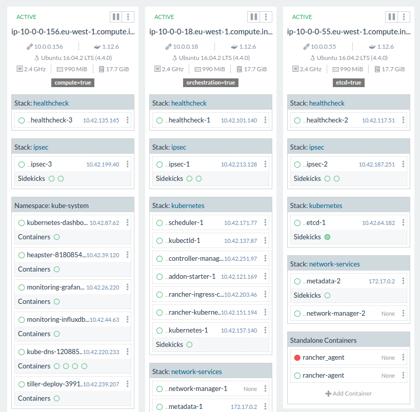

# Rancher Kubernetes scripting

Terraform and Ansible scripting to bring up a plane isolated Kubernetes cluster with Rancher.



rather crude version of it..

## Usage

```
AWS_ACCESS_KEY_ID=.. AWS_SECRET_ACCESS_KEY=.. AWS_DEFAULT_REGION=eu-west-1 terraform plan
AWS_ACCESS_KEY_ID=.. AWS_SECRET_ACCESS_KEY=.. AWS_DEFAULT_REGION=eu-west-1 terraform apply


ansible-playbook -i ansible/ec2.py ansible/rancher-master.yml
ansible-playbook -i ansible/ec2.py ansible/kubernetes.yml
```
## Random notes
```
ansible -i ansible/ec2.py tag_Type_Test -u ubuntu -m ping
```

## Inspired by

* https://github.com/galal-hussein/Rancher-Ansible
* http://rancher.com/aws-rancher-building-resilient-stack/
